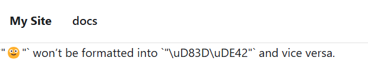
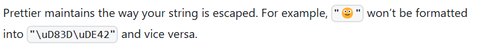
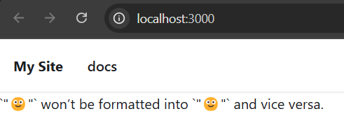
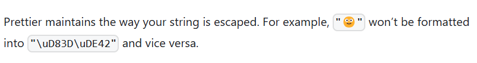
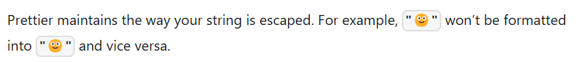

# Docusaurus inconsistent emoji rendering

## With webpack

Home page (jsx):

Doc index (md):

## With rspack:

Home page (jsx):

Doc index (md) during development:

Doc index (md) served after build:

